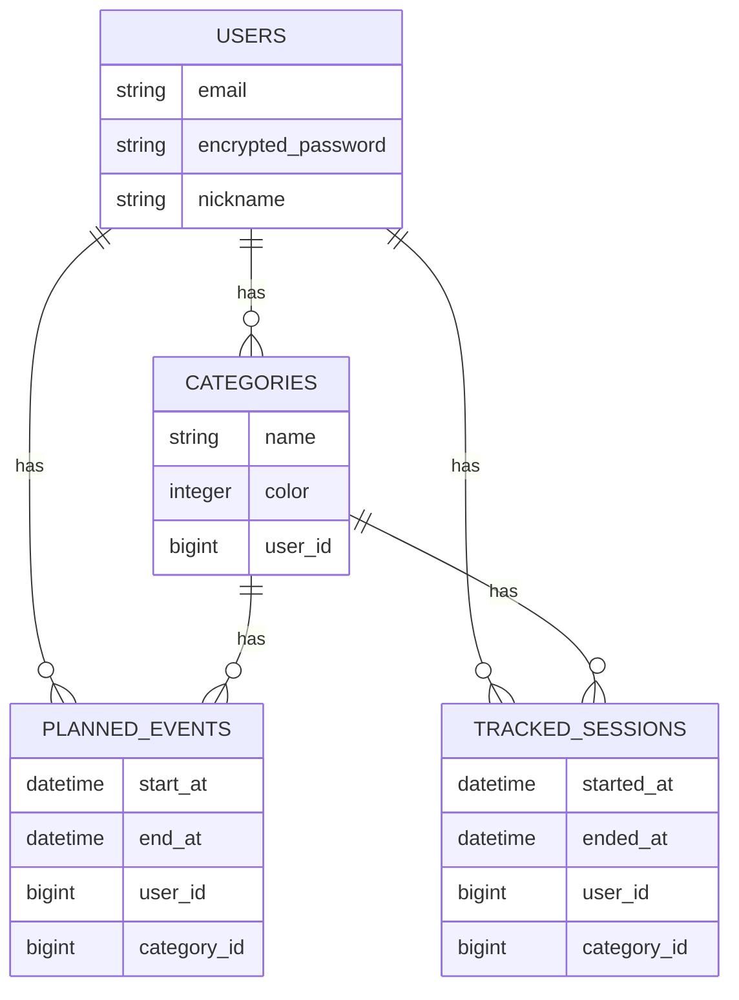
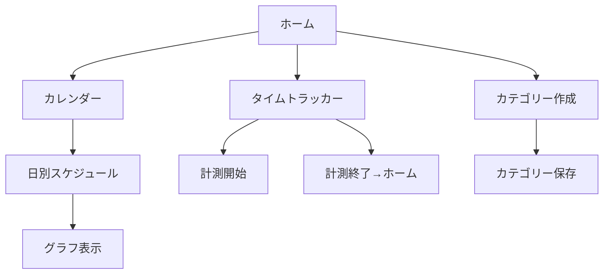

# README

# アプリケーション名  
**Schedule Tracker（スケジュールトラッカー）**

---

## 🌟 アプリケーション概要  
日々の予定と実際の行動を記録・可視化することで、  
時間の使い方を分析・改善できるスケジュール管理アプリです。  
カレンダーで予定を立て、タイムトラッカーで実績を記録し、  
円グラフやタイムラインで「計画と実績」を比較できます。

---

## 🔗 URL  
https://schedule-tracker-q0qh.onrender.com

---

## 💡 利用方法  

### 1. カテゴリー作成  
- ホーム画面の「カテゴリー作成」から、  
  カテゴリー名と色を選択して登録します。  
- 登録したカテゴリーは、予定・計測の両方で使用可能です。

### 2. 予定登録（カレンダー機能）  
1. ホーム画面の「カレンダー」ボタンを押下  
2. 任意の日付をクリックし、  
   「開始時間」「終了時間」「カテゴリー」を入力して追加  
3. 予定はカレンダー上で確認・管理できます  

### 3. 実績記録（タイムトラッカー機能）  
1. 「計測」ボタンを押下  
2. 「開始」ボタンで計測開始  
3. 「終了」ボタンで計測終了し、自動的にホームへ遷移  
4. 計測結果は「その他」カテゴリーで保存されます  

### 4. 分析（グラフ表示）  
- カレンダーで日付をクリックすると、  
  当日の「計画」と「実績」が円グラフ・タイムラインで比較表示されます。

---

## 🎯 アプリケーションを作成した背景  
プログラミング学習を進める中で、  
「1日の行動時間を可視化して改善したい」という思いから開発を開始しました。  
既存のToDoアプリでは“予定管理”しかできず、  
“実際の行動”との比較が難しいことに課題を感じたため、  
「予定 × 実績 × グラフ分析」を一体化したこのアプリを制作しました。

---

## 🧩 洗い出した要件  
- ユーザー管理機能（Devise）  
- カテゴリー作成（ActiveRecord + Enumカラー管理）  
- カレンダー機能（予定登録/日別表示）  
- タイムトラッカー機能（リアルタイム計測）  
- グラフ可視化（Chart.js）  
- 日別ページで「予定」と「実績」を同時に表示  

---

## 🖼 実装した機能の画面・GIFなど  
（※後で画像やGIFを貼り付け）  

---

## 🔧 実装予定の機能  
- 予定の編集  
- 実績の編集・削除  
- カレンダーに「今日」を表示 
- サーバーをAWSに変更

---

## 🗄 データベース設計  

---

## 🗄 画面遷移図  

---

## 🗄 開発環境  

- フロントエンド：HTML / CSS / JavaScript / Chart.js
- バックエンド：Ruby on Rails 7.1 
- データベース：MySQL 
- 認証：Devise  
- デプロイ：Render 
- テスト：RSpec / FactoryBot
- エディタ：Visual Studio Code

---

## ローカルでの動作方法
- $ git clone https://github.com/yourname/schedule_tracker.git
- $ cd schedule_tracker
- $ bundle install
- $ rails db:create
- $ rails db:migrate
- $ rails s

---

## 工夫したポイント
- カレンダー・トラッカー・グラフを連携させた統合設計
- 「予定」と「実績」を別モデルに分け、柔軟なデータ分析を可能に
- Chart.js と CSS Grid を組み合わせ、iPhone風UIを再現
- 「その他」カテゴリーを自動生成して初心者でも迷わない設計

---

## 作者
大戸 琉星（Ryusei Negi）
- エンジニア志望
- プログラミング学習を通じて生産性向上ツール開発に情熱
